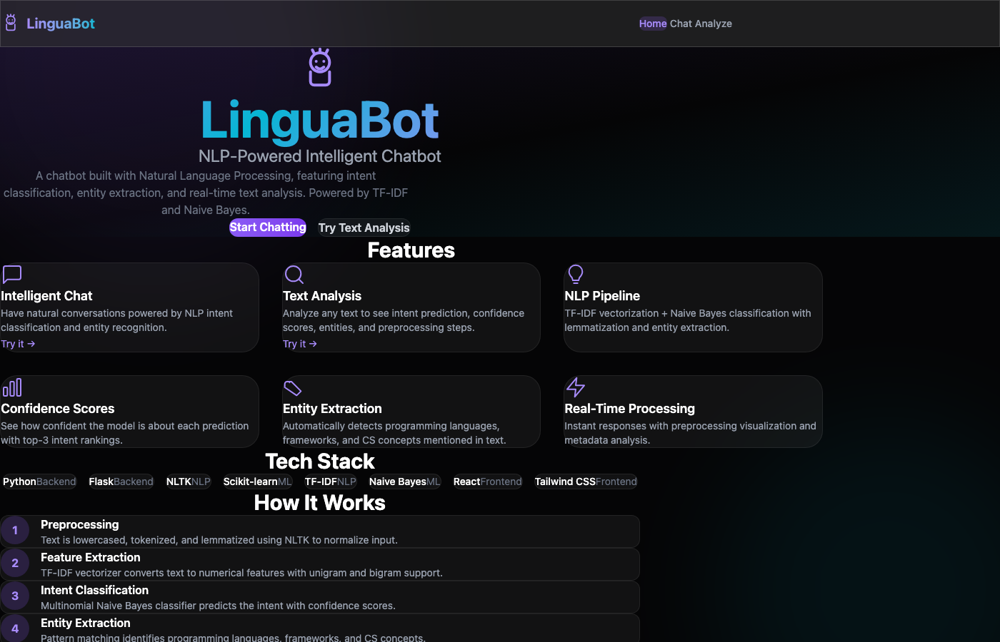
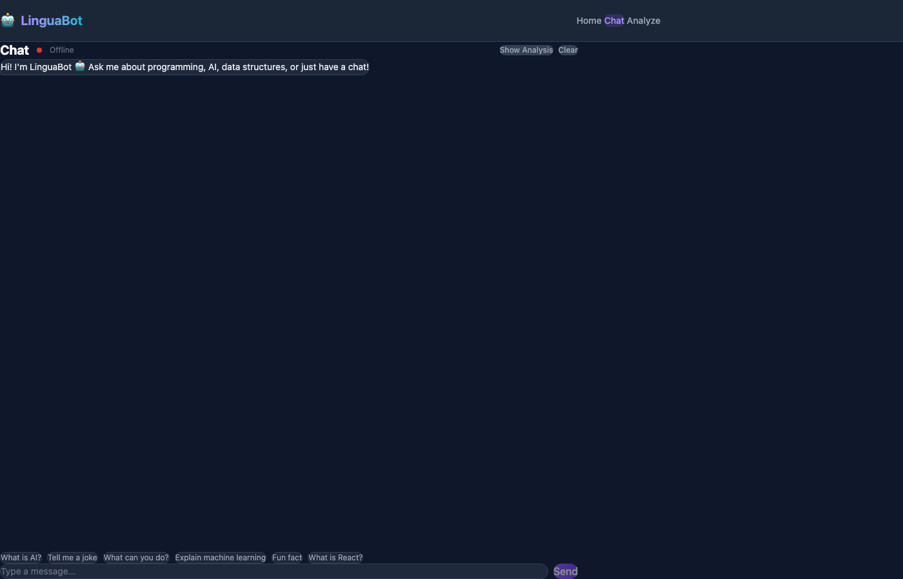
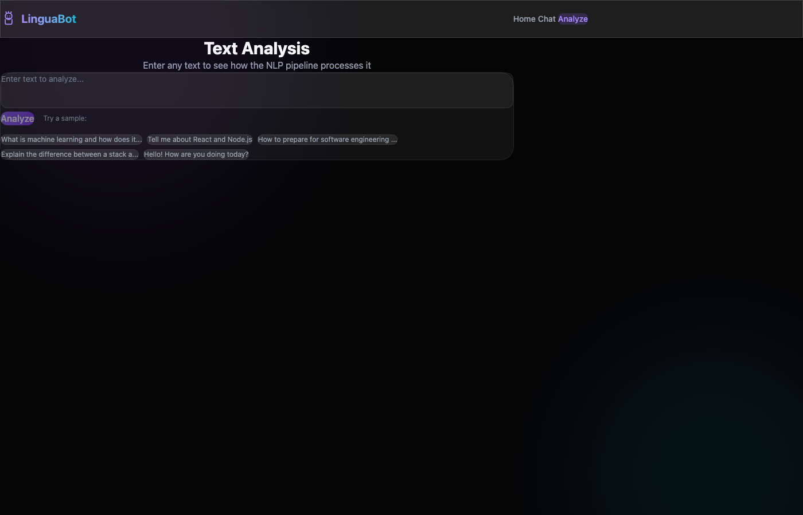

# LinguaBot - NLP-Powered Intelligent Chatbot

An intelligent chatbot built with Natural Language Processing, featuring intent classification, entity extraction, and real-time text analysis. Powered by TF-IDF vectorization and Naive Bayes classification.

**Live Demo:** [https://linguabot-gules.vercel.app](https://linguabot-gules.vercel.app)

## Screenshots

### Landing Page


### Chat Interface


### Text Analysis


## Features

- **Intent Classification** - TF-IDF + Multinomial Naive Bayes pipeline classifies user messages into 15+ intent categories
- **Entity Extraction** - Detects programming languages, frameworks, and CS concepts mentioned in text
- **Confidence Scoring** - Shows prediction confidence with top-3 intent rankings
- **Text Preprocessing** - NLTK-based tokenization, lemmatization, and normalization
- **Interactive Chat** - Real-time chat interface with quick replies and typing indicators
- **Text Analysis Tool** - Analyze any text to visualize the full NLP pipeline output
- **Session Management** - Chat history tracking with session-based conversations

## Tech Stack

### Backend
- **Python 3** - Core language
- **Flask** - REST API framework
- **NLTK** - Natural language preprocessing (tokenization, lemmatization)
- **Scikit-learn** - TF-IDF vectorization + Naive Bayes classification
- **NumPy** - Numerical computing

### Frontend
- **React 19** - UI framework
- **Vite** - Build tool
- **Tailwind CSS 4** - Styling
- **Framer Motion** - Animations
- **React Router** - Client-side routing

## Getting Started

### Backend Setup

```bash
cd backend

# Create virtual environment
python -m venv venv
source venv/bin/activate  # On Windows: venv\Scripts\activate

# Install dependencies
pip install -r requirements.txt

# Run the server
python app.py
```

The backend runs on `http://localhost:5200`

### Frontend Setup

```bash
cd frontend

# Install dependencies
npm install

# Run development server
npm run dev
```

The frontend runs on `http://localhost:5173` and proxies API requests to the backend.

## API Endpoints

| Endpoint | Method | Description |
|----------|--------|-------------|
| `/api/health` | GET | Health check and model info |
| `/api/chat` | POST | Send message and get response |
| `/api/analyze` | POST | Analyze text (intent, entities, preprocessing) |
| `/api/intents` | GET | List all available intents |
| `/api/history/:id` | GET | Get chat history for a session |
| `/api/history/:id` | DELETE | Clear chat history |

## NLP Pipeline

```
Input Text
    ↓
Preprocessing (lowercase, tokenize, lemmatize)
    ↓
TF-IDF Vectorization (unigrams + bigrams)
    ↓
Naive Bayes Classification
    ↓
Entity Extraction (regex pattern matching)
    ↓
Response Selection + Confidence Scoring
```

## Project Structure

```
LinguaBot/
├── backend/
│   ├── app.py              # Flask API server
│   ├── nlp_engine.py       # NLP pipeline (TF-IDF + NB classifier)
│   ├── intents.json         # Training data (patterns + responses)
│   ├── config.py            # Configuration
│   └── requirements.txt     # Python dependencies
├── frontend/
│   ├── src/
│   │   ├── pages/
│   │   │   ├── Home.jsx     # Landing page
│   │   │   ├── Chat.jsx     # Chat interface
│   │   │   └── Analyze.jsx  # Text analysis tool
│   │   ├── components/
│   │   │   └── Navbar.jsx   # Navigation
│   │   ├── App.jsx          # Root component
│   │   ├── main.jsx         # Entry point
│   │   └── index.css        # Global styles
│   └── package.json
└── README.md
```

## Intent Categories

| Intent | Description | Example |
|--------|-------------|---------|
| greeting | Greetings | "Hello!", "Hi there" |
| programming | Programming topics | "What is Python?" |
| ai_ml | AI/ML concepts | "Explain deep learning" |
| data_structures | DSA topics | "What is a binary tree?" |
| web_development | Web dev | "What is React?" |
| career | Career advice | "How to prepare for interviews?" |
| joke | Jokes | "Tell me a joke" |
| fun_fact | Fun facts | "Tell me something interesting" |

## License

MIT
